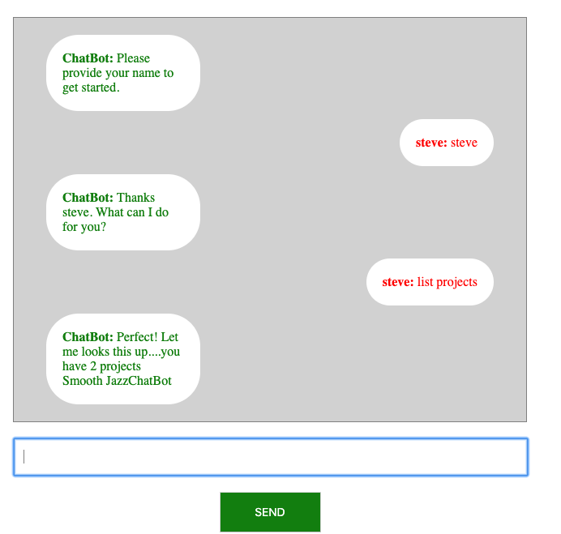

# Django Channels Chat Bot Demo

Chat bot utilizing Django Channels, Redis and containerized with Docker.




#### Getting Started
```
1. Make sure that docker / PostgreSQL is running.
```

### Prerequisites
```
1. python > 3.6 (async & await)
2. Docker
3. Redis
4. PostgreSQL
```

### Installing / Running Server
```
1. Goto root directory.
2. Create an .env file and add CHAT_BOT_KEY for settings file.
3. Run `docker-compose build`
4. Run `docker-compose run web python manage.py makemigrations chatapp`.
5. Run `docker-compose run web python manage.py migrate`.
6. Run `docker-compose run web python manage.py createsuperuser` and create an admin account.
7. Run `docker-compose up` to start the server.
8. Goto `localhost:8000/admin` sign in and add some data.
9. Goto `localhost:8000` and try out the bot.
```

## License

This project is licensed under the MIT License - see the [LICENSE.md](LICENSE.md) file for details
